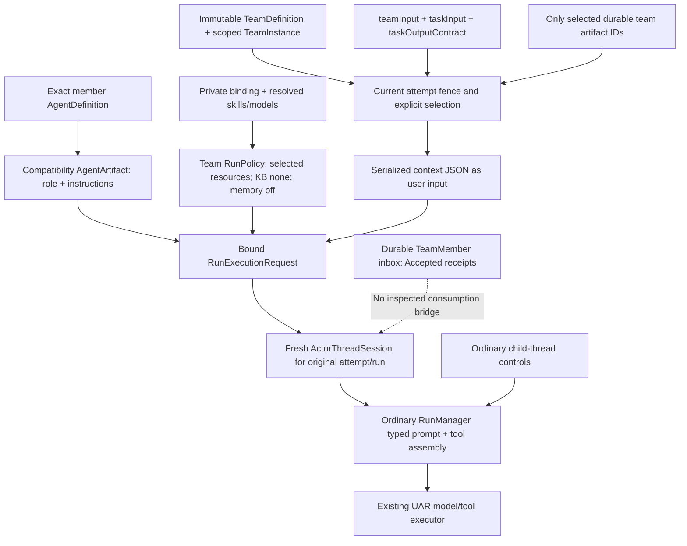

# Context, definitions and communication assessment

Stage: Assess — `agent-fabric-convergence::uar-team-execution-architecture`. Source inspection only, 29 September 2026. Architecture analysis is not production verification. No production file, dependency, canonical record or runtime state was changed; no build, test, probe or service operation was run. The only write is this assessment.

## Finding and scope

Current C09 source supports an operator-admitted member task through the ordinary UAR executor, with explicit artifact disclosure and restrictive resource binding. It does not yet provide the durable-member discovery and communication bridge needed for autonomous peer teamwork. Existing child-thread tools operate in another identity plane. Adding a shared prompt or roster cannot make those tools address durable members, consume the team inbox or admit another member's task.

That is an architecture scope gap, separate from the gateway request failure recorded in the child handoff. It does not justify a new model loop, scheduler daemon or team-store rewrite. Preserve the current catalog and executor; decide whether the next approved delivery promises operator-managed task execution only or also governed member-to-member collaboration. Broader schema acceptance must not be presented as the latter.

## Evidence anchors and limits

| Anchor | Exact revision and inspection boundary |
| --- | --- |
| UAR | `/Users/gqadonis/Projects/prometheus/worktrees/agent-fabric-c09-uar`, HEAD `006eeaf1f90e0a640b0f8fd568419badac5f4320`. Inspected collaboration/runtime files are committed at this revision. Status also shows uncommitted repairs in `src/llm/{orchestrator,prompt_dialect,provider_error}.rs` and untracked `dist/`; none was reviewed or modified for this assessment. |
| Codex reference | `/Users/gqadonis/Projects/references/codex`, HEAD `986ff1cc7ced0081ec5014b700a376333d87f869`; status was clean. This matches the prior local Codex research pin. |
| Current document profile | UAR `docs/agents/collaboration/v0.1.0-draft.2/README.md:5–9,34–56,82–88`: schema validity, retained fields and effective binding are distinct; the document checkpoint itself makes no durable-team runtime conformance claim. |
| Approved predecessor | UAR `docs/agents/collaboration/v0.1.0-draft.1/{definitions,runtime,governance}.md`, especially `definitions.md:19–27`, `runtime.md:28–34`, `governance.md:18–24`. Broader context, durable inbox and subteam requirements are not automatically delivered by C09. |
| Prior research | Initiative `children/uar-team-specification/research/{report.md,source-verification.md,sources/local-source-receipts.json}` under `.kbd-orchestrator/phases/agent-fabric-convergence/`. The UAR research pin was `a54dd9591dfeaff8694252b69d2d40f0f28e2250`; its historical projection gap cannot be assumed unchanged. Codex's pin is unchanged and was re-inspected at actual call sites. |
| Operation evidence | The current child's `handoff-in.md` records build/launch success and failed real team turns, including gateway rejection of `thinking`. It records no successful team inference or settled usage for that attempt. This assessment consumes that evidence boundary; it does not rerun or independently certify those receipts. |

Source aliases below: UAR compiler/runtime/api/domain paths are relative to `<UAR checkout>/src/uar/`; UAR `docs/` paths are relative to the checkout. Codex source paths are relative to `<Codex checkout>/codex-rs/core/src/`. File:line references identify source mechanisms, not an installed behavioral pass. The parent owns stage transitions and the combined evidence matrix; this document does not complete Assess or change C09/C10 status.

Applicable instructions read: initiative `AGENTS.md`, child handoff/goals/scope/progress, UAR `AGENTS.md`, `versions.toml` and waypoint, Codex `AGENTS.md`, relevant UAR gotchas, and the `kbd-assess` source/spec assessment structure. Parent restrictions supersede skill preflight, probes, lifecycle mutations and additional review dispatch for this assigned read-only subassessment.

## Actual context assembly

Call sequence: UAR `runtime/team_execution/execution.rs:188–199` resolves the member and selected context, constructs `RunExecutionRequest::from_bound_agent`, attaches the team attempt, and uses a fresh `team-attempt:<id>` session. `execution.rs:223–239` calls `ActorThreadSession::execute_request` with the original run ID. `runtime/turn/request.rs:199–244` attaches exactly resolved skills and applies `teamRunPolicy`. This is concrete reuse of ordinary execution, not an alternate team model loop.

### Shared team prompt and member prompt precedence

**Implemented:** the member's immutable `role` becomes `AgentArtifact.prompt.system`, and its `instructions` becomes an instruction fragment: UAR `compiler/collaboration/validation/projection.rs:116–145`. `runtime/turn/builtin.rs:14–35` marks these as AgentIdentity/System and HostInstructions/Host fragments. The renderer orders sections deterministically, then stable fragment IDs: `runtime/prompt/assemble.rs:12–24,211–218`. The ordinary/typed paths assemble that rendered system context: `runtime/manager.rs:4729–4741`; `runtime/turn/builtin.rs:233–252`.

**Missing/unmodeled:** draft.2 `team-definition.schema.json:36–43,72–85` has team `purpose` and member `responsibility`, but no shared team-instructions field or team/member conflict-precedence contract. The actual member context projection is only `teamInput`, `taskInput`, `taskOutputContract` and selected artifacts: UAR `compiler/collaboration/team_execution/scope.rs:48–100`. Team purpose, role responsibility, coordinator identity and roster are not projected there. A user may put a mission in `teamInput`, but that is user/task data, not a separately bound shared prompt with an accepted precedence policy.

This is not evidence that member instructions are missing. They are implemented through the compatibility artifact. It is evidence that a proposed shared team prompt needs a versioned source, provenance, authority classification and conflict rule. Render order alone is not a guaranteed semantic conflict resolver, and prompt text cannot grant tool authority.

### Roster discovery and tools

**Implemented for operators:** `compiler/collaboration/team_planning.rs:120–138,166–189` creates and retrieves a scoped TeamInstance with member IDs, roles and immutable definitions. `team_planning.rs:322–382` retains slots/kinds/definitions. The UI/API can inspect the durable roster.

**Different model-facing plane:** `compiler/collaboration/team_execution/resolution.rs:129–136` adds ordinary `AGENT_TOOL_NAMES`, `activate_skill` and tool search to the requested resource policy. The names are `spawn_agent`, `send_agent_message`, `wait_agents`, `list_agents`, `interrupt_agent`: UAR `runtime/thread/control.rs:24–31`. Actual availability still depends on host policy and current authorization; adding a name does not guarantee its exposure or execution (`control.rs:337–355`). Root-bound handlers are installed through `runtime/manager.rs:4581–4615`.

`list_agents` lists children in the caller's root tree and removes roots: UAR `runtime/thread/control.rs:456–478`. Its description explicitly lists child-thread identities rather than team members (`runtime/native_skills/agents/mod.rs:35–50`). Each C09 member attempt is a fresh root. A sibling durable TeamMember's ID is not thereby a child-thread target or discoverable roster entry. The inspected tool module has no TeamInstance/TeamMember target resolver.

**Central gap:** there is no inspected governed model-facing operation that resolves a current owner/workspace/team/member target, enforces the declared communication edge, commits a durable team message or requests another member's C09 admission. A roster fragment could make identities visible; it cannot supply this missing routing/authorization implementation. Keep ordinary child controls explicitly separate if they remain exposed.

### Messaging versus activation

The durable operator team mailbox is implemented. UAR `compiler/collaboration/team_mailbox.rs:19–107` binds the sender to the authenticated owner, validates recipient/task scope and commits an `Accepted` envelope plus command receipt with catalog CAS. `TeamMailboxGrant` rejects stopped/revoked recipients and stale task/assignment/reviewer fences (`team_mailbox.rs:273–341`). API `api/collaboration/team_mailbox.rs:39–57` returns that durable result; it does not dispatch a turn.

The broader runtime contract distinguishes accepted, delivered and processed; queue-only must not activate idle members, while triggering task delivery must admit a fresh turn: UAR `docs/agents/collaboration/v0.1.0-draft.1/runtime.md:28–34`.

Production symbol searches across `src/**/*.rs`, excluding test files, found no caller of `mark_team_message_delivered` or `mark_team_message_processed` outside their implementation. Neither `TeamInboxMessage` nor the team mailbox is consumed by the selected-context or team actor execution path. `trigger-turn` in this durable envelope is retained intent, not proof of activation. Sender-member identity, role-to-role edge enforcement and broadcast recipient capture are not implemented by the operator-only route. Graph validation checks communication references (`compiler/collaboration/validation/graph.rs:181–190`), which is document validation rather than message delivery enforcement.

Counterevidence: ordinary child-thread messaging does distinguish queue-only from trigger. UAR `runtime/thread/service.rs:1290–1355` resolves a live thread, checks admission/budget, assigns metadata/sequence and queues or launches its child. `runtime/thread/messages.rs:49–75,84–92` binds root/sender identity and converts only the body to user input. This works in the root thread tree, with an in-memory mailbox at that call site; it is not the durable team inbox service or a cross-attempt member activation bridge.

### Selected artifacts, history and project instructions

**Implemented isolation:** UAR `compiler/collaboration/team_execution/scope.rs:48–100` checks the current attempt fence, reads the authoritative stored selection, resolves each artifact by exact owner/workspace/team key and emits only those records. `scope.rs:103–158` publishes one deterministic immutable output artifact per authorized attempt. `runtime/team_execution/execution.rs:66–117` validates the task output and handles unconfirmed publication explicitly. These paths counter a blanket-history-copy diagnosis.

**Deliberate current restriction:** the fresh member session receives the selected JSON, not prior member sessions or all team output. `runtime/manager.rs:3639–3648` also resets project-instruction discovery for team attempts and their delegated children. `runtime/project_instructions.rs:22–28` defaults to no trusted workspaces, avoiding ambient AGENTS discovery. Generic world-state fragments still exist; selected-artifact-only does not mean there are no ordinary policy/tool/environment fragments.

**Broader authored context remains unconsumed:** AgentDefinition `context` has artifacts/history/memoryScopes, and private DeploymentBinding has `contextGrants`. The inspected team resolver does not map those declarations into artifact allowlists, selected history or memory access. The existing receipt must therefore not be read as proof that every requested context selection was honored; the predecessor explicitly requires actual selections/exclusions to be recorded (`draft.1/definitions.md:23`). Whether to enforce these as ceilings on per-task selection or refuse nonempty unsupported requests is an architecture decision, not permission to inherit all history.

### KB, memory and required-semantics diagnostics

UAR `compiler/collaboration/team_execution/resolution.rs:147–158` explicitly selects no knowledge bases or presentations and sets `memory_enabled: Some(false)`. That policy reaches the request through `runtime/turn/request.rs:229–243`; manager KB retrieval is gated by effective KB IDs (`runtime/manager.rs:3782–3787`) and memory fragments by `runtime/turn/builtin.rs:52–55`. No default host KB/memory inheritance is implemented for a team member.

**Required RAG is correctly refused:** `runtime_semantics.rs:40–42` treats `ragConfiguration` and `apiHarness` as unsupported; `runtime_semantics.rs:370–389` emits `RequiredUnsupported` when their semantic requirement has `required: true`. Member resolution rejects such diagnostics before ordinary execution (`team_execution/resolution.rs:104–110`). Do not report that required RAG is silently marked supported while memory is off.

`contextStrategy` is different: `runtime_semantics.rs:309–333` supports an ordinary context-management strategy; the special `{mode: selected}` maps to `ContextStrategy::Auto`. Its Exact diagnostic proves that strategy mapping, not a memory/KB grant or full implementation of AgentDefinition `context`.

**Diagnostic/contract gap:** AgentDefinition `context` is a structurally required object without the semanticRequirement required flag. Binding `contextGrants` is a structurally required string array. Neither is consumed by the inspected team resolver; `bindings.rs:773–781` omits them from the effective receipt's `requested` projection. There is no traced Exact diagnostic for memoryScopes/KB inheritance, so an explicit false support assertion was not observed. There is nevertheless no field-level actual-selection/exclusion evidence for those declarations in this path. Required versus optional treatment for nonempty requests must be made explicit. This is an unimplemented mapping/diagnostic gap, not demonstrated unauthorized disclosure.

Team package preflight is intentionally coarser than member resolution: `compiler/collaboration/bindings.rs:308–361` bases `teamExecution` on the service capability and emits no resolved member models/skills. A successful team binding preflight is not evidence that every member's required RAG or other resource request will execute; those checks occur at member resolution.

### Skills, tools and inheritance

The old research's full-SkillRef loss is not an accurate description of this current collaboration path. `compiler/collaboration/validation/projection.rs:126–145` retains full references. `bindings.rs:546–630` resolves the exact definition/binding/installed version, digest, location, entrypoint, required-tool set and enabled state. Required missing/mismatched skills produce RequiredUnsupported (`bindings.rs:671–678`); member resolution refuses them. `runtime/turn/request.rs:199–223` attaches resolved skills, and `runtime/manager.rs:4123–4130` supplies their bound config to activation.

Team policy selects only resolved skill IDs, their required tool IDs, associated MCP servers and the ordinary control/activation/search factories (`team_execution/resolution.rs:112–158`). Skill candidates are filtered against effective policy (`runtime/manager.rs:3948–3960`). Declaring a preferred skill is not automatically adding every host tool, and exact binding is stronger than an ID-only preference.

For ordinary children, `runtime/thread/kernel.rs:257–287` revalidates the original collaboration binding and restricts resource selection to captured root resources. `kernel.rs:599–623` passes captured models, skills, MCP/native resources, sandbox, approvals and collaboration binding into the same ordinary executor. `thread/service.rs:662–687` resolves a registered artifact and intersects policy before reserving a child. This is real restrictive inheritance, not broad host-resource union.

Gap: the portable `permittedChildren` references are validated for graph closure (`compiler/collaboration/validation/graph.rs:257`) but have no inspected runtime consumer. Ordinary child artifact lookup uses `resolve_registered_agent(artifact_id)` (`runtime/thread/kernel.rs:452–464`); a closure check is not an enforced immutable child-definition allowlist. Existing spawn authorization, owner/live-root checks and policy intersection remain real counterevidence; this assessment does not claim arbitrary privileged spawn. Decide whether ordinary delegation is outside the team profile or must additionally honor immutable child references and team/root ceilings.

### Subteams

Draft.2 accepts member `kind: team` (`team-definition.schema.json:53–60`). Graph validation resolves the matching definition kind and validates coordinator/communication roles (`validation/graph.rs:158–200`). Planning retains a team member's kind and definition (`team_planning.rs:356–365`). These are document/planning support.

Execution resolution explicitly requires `CollaborationKind::AgentDefinition` for the selected member (`team_execution/resolution.rs:28–34`). The inspected path does not create a separately identified child TeamInstance, link it to the parent task or establish the shared root team budget described by `draft.1/definitions.md:27`. Ordinary nested child threads do not satisfy durable subteam semantics. Label subteam execution unsupported; do not flatten it silently or claim schema acceptance as activation support.

## Codex comparison at the pinned revision

These are reusable mechanisms, not conformance evidence for UAR and not a recommendation to import Codex's context policy wholesale.

| Mechanism | Traced Codex source | Implication for UAR |
| --- | --- | --- |
| Discovery plus address resolution | `agent/control.rs:444–462` resolves agent paths through the control registry; `:497–555` lists the live tree. `tools/handlers/multi_agents_v2/list_agents.rs:44–55` calls that control service. | Model-visible names have an actual target resolver. Durable UAR member names need their own governed resolver, not just a printed roster. |
| Roster in model context | `agent/control.rs:475–494` formats actual open children; `session/world_state.rs:82–89,244` consumes it when environment context is enabled; `context/world_state/environment.rs:302–309` renders the subagent section. | Concrete producer→context call sites exist. UAR's inspected team path lacks an equivalent durable-member projection. Codex's roster is still a runtime tree, not a persistent enterprise team board. |
| Message versus work | `multi_agents_v2/send_message.rs:41–48` selects QueueOnly; `followup_task.rs:41–48` selects TriggerTurn. Shared `message_tool.rs:68–104` resolves a real recipient and loaded agent, rejects root follow-up and supplies sender path. `agent/control.rs:217–238` checks execution capacity only for trigger. | Separate intent and activation are practical. UAR's durable inbox needs an explicit admission bridge rather than promoting accepted text into authorization. |
| Role/instruction precedence | `multi_agents_v2/spawn.rs:125–145` derives parent config, handles model/fork options and applies a role; `agent/role.rs:178–190` clones config and replaces developer instructions when specified. `agent/control/spawn.rs:826–858,916–969` materializes history and replaces the inherited parent developer fragment for the chosen child override. | Precedence is implemented as typed config/history behavior, not assumed from concatenation. UAR should freeze its own team/member provenance and precedence contract. |
| Restrictive role resource changes | `agent/role.rs:91–117` permits role disabling of selected features/skills; `:213–223` applies those disables to parent-derived config. | Resource inheritance and prompt inheritance are separate operations. This does not prove UAR's KB/memory/skill grants or support subteams. |
| Fork filtering differs from UAR | `agent/control/spawn.rs:63–101` keeps system/developer/user messages and final assistant replies, excludes tool calls, reasoning, inter-agent communication and inherited usage. UAR `thread/spawn.rs:10–23,126–166` excludes parent system context and retains selected user/final-assistant dialogue. | Do not call these equivalent “full history.” Adopting the Codex rule would change UAR's deliberate boundary and requires an explicit decision. |
| Residency versus execution | `agent/control/residency.rs:139–154,233–238` materializes history before unloading and avoids pending mailbox/active turns; `agent/control/execution.rs:32–57` independently checks active execution capacity. | Durable identity, loaded resources and active work are distinct. These mechanisms do not prove UAR inbox transactions, remote storage behavior, fair scheduling or restart correctness. |

## Bounded decisions for Analyze/Plan

1. **Promise and identity:** retain operator-managed member turns as the current executable scope, or add durable peer collaboration with explicit TeamInstance/TeamMember targets. Keep ordinary root-thread children separately named. Roster text alone is insufficient.
2. **Context contract:** decide whether team purpose/responsibility is informational or a shared instruction layer. Freeze its immutable source, authority/provenance, precedence and bounded roster projection. Preserve task/artifact content as data; no prompt grants authority.
3. **Communication:** define authenticated member sender/recipient resolution, current role-edge checks, durable accepted/delivered/processed receipts, task correlation, queue-only consumption and fresh admission for trigger mode. Reuse the catalog CAS and existing UAR executor, not another model loop.
4. **Resource semantics:** keep KB/memory disabled for the approved narrow profile unless explicitly implemented. For authored context/history/memoryScopes/contextGrants, record actual selection/exclusion or refuse unsupported requirements. Do not turn contextStrategy Exact into a broader support claim. Preserve exact skill bindings and captured child intersections.
5. **Nested work:** explicitly refuse durable subteam execution and unresolved permittedChildren semantics in the narrow supported profile, or separately approve their exact mapping/root-ledger contract. Ordinary thread nesting is not an implementation shortcut for subteams.

Required RAG refusal, selected-artifact namespace checks, exact skill binding, root-local control authorization and captured policy intersection are important counterevidence against a wholesale architecture-failure claim. Conversely, fixing the provider request and obtaining one successful member answer would still not prove autonomous team communication, subteams or complete context-resource fidelity. Both facts must survive the child decision packet.

This assessment recommends a bounded reconciliation and repair disposition. It does not select C10's workflow engine, approve the previously proposed qualification-sequencing amendment, expand connector scope or request another broad research round. C10 must consume the explicitly supported team contract and accepted operation receipt before adding workflow progression.
