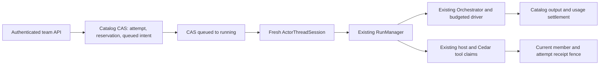

# Runtime architecture assessment — UAR team execution

Assessment stage, 2026-09-29. Role: boss-runtime. Scope: committed and dirty UAR source, existing failure evidence and approved collaboration contracts. This document is the only new artifact written by this assessment. No code changes, builds, tests, operational probes, formatting or commits were performed. The earlier three-file provider repair remains preserved and unverified.

## Source and contract identity

UAR checkout: `/Users/gqadonis/Projects/prometheus/worktrees/agent-fabric-c09-uar`, HEAD **006eeaf1f90e0a640b0f8fd568419badac5f4320**. Dirty tracked files at assessment start:

| File | Working file Git blob identity | Meaning |
| --- | --- | --- |
| `src/llm/orchestrator.rs` | `d6f9da325074c0c03da27023170530c307c25f05` | Preserve typed provider failure codes |
| `src/llm/prompt_dialect.rs` | `cf09d30dbdd973c9769b0ec3dde583be48b19418` | Stop implicitly requesting Kimi thinking from message count |
| `src/llm/provider_error.rs` | `14c534a6724093bc8a14038a895cb5e791f626f8` | Stable codes for existing provider error classes |

`dist/` is untracked build output; it was not modified or inspected as source. Citations below refer to this checkout and these working file identities, not an assumed future commit. The initiative position was restored to `agent-fabric-convergence > uar-team-execution-architecture`; parent reported canonical assessment revision 349. The [boss-runtime role](/Users/gqadonis/Projects/prometheus/worktrees/the-boss-d01-build/.codex/agents/boss-runtime.toml:1), team README/routing/tool policy, UAR AGENTS.md, versions.toml and named specifications were read. Source searches substitute for a Boss graph because this assignment concerns UAR source and forbids runtime probes; no graph execution proof is claimed.

Contracts read in full: [C09.3 proposal](/Users/gqadonis/Projects/prometheus/worktrees/agent-fabric-c09-uar/openspec/changes/afc-c09-team-admission-runtime/proposal.md:1), [design](/Users/gqadonis/Projects/prometheus/worktrees/agent-fabric-c09-uar/openspec/changes/afc-c09-team-admission-runtime/design.md:1), tasks and durable-team-execution spec delta; collaboration-package-catalog OpenSpec; approved [draft.1 runtime contract](/Users/gqadonis/Projects/prometheus/worktrees/agent-fabric-c09-uar/docs/agents/collaboration/v0.1.0-draft.1/runtime.md:1); draft.1 and draft.2 profile READMEs. Draft.1 explicitly describes a future conforming implementation and separates document, durable-local-runtime and federated conformance. Draft.2 is a document checkpoint, not durable-team certification. [Draft.1 conformance classes](/Users/gqadonis/Projects/prometheus/worktrees/agent-fabric-c09-uar/docs/agents/collaboration/v0.1.0-draft.1/README.md:19), [draft.2 status](/Users/gqadonis/Projects/prometheus/worktrees/agent-fabric-c09-uar/docs/agents/collaboration/v0.1.0-draft.2/README.md:3).

## Recommendation

Use this child to freeze the missing support, lifecycle, recovery and accounting decisions before resuming C09 acceptance. Retain the existing UAR execution owner. Source shows a thin team dispatch/controller layer over the ordinary actor host and model runtime; the observed failures do not establish that a second executor or wholesale rewrite is needed. Successful bounded execution, revocation and restart behavior remain unproven by the failed packaged operation.

## Material findings

### 1. One execution owner exists; preserve it

**Source-backed behavior.** `TeamExecutionRuntime::dispatch` claims a catalog intent and starts one Tokio worker. The worker waits on a member lane, then `execute_turn` creates a fresh `team-attempt:{id}` session and calls `ActorThreadSession::execute_request` with the durable attempt's root run ID. Actor admission validates owner/artifact/session, persists a fresh root and calls `RunManager::start_hosted_root_turn`. The team layer contains no model/tool iteration loop. [Controller dispatch](/Users/gqadonis/Projects/prometheus/worktrees/agent-fabric-c09-uar/src/uar/runtime/team_execution/controller.rs:80), [ordinary actor reuse](/Users/gqadonis/Projects/prometheus/worktrees/agent-fabric-c09-uar/src/uar/runtime/team_execution/execution.rs:177), [actor host ownership](/Users/gqadonis/Projects/prometheus/worktrees/agent-fabric-c09-uar/src/uar/runtime/thread/actor_host.rs:242).

**Counterevidence to rewriting.** Catalog state, host authority, actor cleanup, tool admission and provider execution already have distinct owners. Fresh roots intentionally avoid resurrecting old approval/tree authority. Retaining this separation directly matches draft.1 ownership and restart constraints. [Runtime ownership](/Users/gqadonis/Projects/prometheus/worktrees/agent-fabric-c09-uar/docs/agents/collaboration/v0.1.0-draft.1/runtime.md:3), [fresh roots](/Users/gqadonis/Projects/prometheus/worktrees/agent-fabric-c09-uar/src/uar/runtime/thread/actor_host.rs:277).

**Decision needed.** Freeze the team attempt as the durable scheduling/accounting envelope and ordinary actor root as its bounded execution. Do not treat the process-local job map as another business-state store. This assessment does not independently prove execution exclusivity under process loss or remote multi-host recovery.

### 2. Durable admission and effect fencing are substantive existing mechanisms

**Source-backed behavior.** Admission checks authenticated owner/workspace, command digest, expected team/task revisions, current assignee/role, dependency success, member revoked/stopped state and binding revision. It sums settled usage or retained reservations, narrows immutable team concurrency/budgets by private binding limits, and writes attempt, root run ID, queued intent, task transition and command receipt in one catalog CAS. The storage contract replaces one catalog generation; Surreal uses a conditional generation update. [Admission](/Users/gqadonis/Projects/prometheus/worktrees/agent-fabric-c09-uar/src/uar/compiler/collaboration/team_execution/admission.rs:13), [aggregate budgets](/Users/gqadonis/Projects/prometheus/worktrees/agent-fabric-c09-uar/src/uar/compiler/collaboration/team_execution/admission.rs:127), [atomic write](/Users/gqadonis/Projects/prometheus/worktrees/agent-fabric-c09-uar/src/uar/compiler/collaboration/team_execution/admission.rs:206), [storage CAS](/Users/gqadonis/Projects/prometheus/worktrees/agent-fabric-c09-uar/src/uar/compiler/collaboration/storage.rs:91).

The current fence compares member revision, task assignee/ownership epoch, binding revision, attempt execution epoch and identity, and live queued/running state. Exact member resolution recomputes the receipt; the effect revalidator compares stable receipt content. `ToolAdmissionRuntime::claim` calls the catalog revalidator before the existing host revalidation and Cedar policy check. Children inherit the collaboration binding. [Fence](/Users/gqadonis/Projects/prometheus/worktrees/agent-fabric-c09-uar/src/uar/compiler/collaboration/team_execution/mod.rs:51), [receipt comparison](/Users/gqadonis/Projects/prometheus/worktrees/agent-fabric-c09-uar/src/uar/runtime/team_execution/epoch.rs:7), [claim boundary](/Users/gqadonis/Projects/prometheus/worktrees/agent-fabric-c09-uar/src/uar/runtime/tool_admission/lifecycle.rs:390), [child propagation](/Users/gqadonis/Projects/prometheus/worktrees/agent-fabric-c09-uar/src/uar/runtime/thread/kernel.rs:608).

**Unproven behavior.** The current failed real path does not prove duplicate-dispatch, stale-owner, exhausted-budget or revocation-before-effect acceptance. The CAS source is structural evidence, not backend certification. No rewrite is justified merely by those outstanding gates.

### 3. Remote availability is advertised more broadly than the available proof

**Source-backed contract gap.** `team_execution_available` is true for durable local instance storage **or** a configured remote Surreal URL. That flag inserts `collaboration_team_execution_v1`; capability responses set both `activation.teamInstance` and `activation.teamExecution` from it. These conditions inspect implementation/storage configuration, not a backend acceptance receipt. [Availability condition](/Users/gqadonis/Projects/prometheus/worktrees/agent-fabric-c09-uar/src/server.rs:782), [capability projection](/Users/gqadonis/Projects/prometheus/worktrees/agent-fabric-c09-uar/src/uar/api/capabilities.rs:180).

C09.3 explicitly requires the selected remote path to be proved before advertising remote team execution. Local durable AgentInstance support is enabled only for `surrealkv://`, while the ordinary actor thread store has a separate Surreal transaction implementation. A remote catalog therefore has plausible source support, but local instance support cannot certify it. [C09 proposal](/Users/gqadonis/Projects/prometheus/worktrees/agent-fabric-c09-uar/openspec/changes/afc-c09-team-admission-runtime/proposal.md:16), [local instance detection](/Users/gqadonis/Projects/prometheus/worktrees/agent-fabric-c09-uar/src/uar/persistence/providers/surreal.rs:171), [actor root transaction](/Users/gqadonis/Projects/prometheus/worktrees/agent-fabric-c09-uar/src/uar/persistence/providers/surreal.rs:1226).

**Blocking decision for advertised remote durability.** Freeze a backend support/proof matrix and distinguish code availability from demonstrated conformance. No remote acceptance receipt was supplied or discovered in the bounded evidence inspected here. Do not infer remote proof from URL shape, CAS source, a local build or a local failed operation. This is narrower than implementing federated execution, which draft.1 excludes from the first release.

### 4. Recovery preserves uncertainty, but its ownership scope needs an explicit decision

**Source-backed behavior.** A dispatch claim changes queued to running by CAS before kernel entry. Operator recovery checks command replay first, refuses locally live jobs, marks previously running/cancellation-requested attempts uncertain, retains reservations and dispatches only queued attempts. It does not replay possibly dispatched work or restore its live authority. Cancellation records intent, then cancels the local job and owner-bound run; member revocation bumps disclosure/ownership fences and requests cancellation without releasing unknown usage. [Dispatch claim](/Users/gqadonis/Projects/prometheus/worktrees/agent-fabric-c09-uar/src/uar/compiler/collaboration/team_execution/settlement.rs:12), [local live guard](/Users/gqadonis/Projects/prometheus/worktrees/agent-fabric-c09-uar/src/uar/runtime/team_execution/controller.rs:200), [durable recovery](/Users/gqadonis/Projects/prometheus/worktrees/agent-fabric-c09-uar/src/uar/compiler/collaboration/team_execution/recovery.rs:98), [revocation](/Users/gqadonis/Projects/prometheus/worktrees/agent-fabric-c09-uar/src/uar/compiler/collaboration/team_execution/scope.rs:205).

**Source-only limitations.** The server creates the runtime but does not invoke a startup recovery scan in that initialization path. Recovery is an explicit authenticated route. The locally-live check cannot establish that a worker on another host has stopped; attempt fields contain no durable worker lease/host ownership. A replayed recovery command returns its receipt without resuming the dispatch loop, so a crash after the recovery CAS and before dispatch can leave queued intents awaiting another recovery command. [Initialization](/Users/gqadonis/Projects/prometheus/worktrees/agent-fabric-c09-uar/src/server.rs:1376), [recovery route](/Users/gqadonis/Projects/prometheus/worktrees/agent-fabric-c09-uar/src/uar/api/collaboration/team_execution.rs:101), [attempt fields](/Users/gqadonis/Projects/prometheus/worktrees/agent-fabric-c09-uar/src/uar/domain/team_execution.rs:28), [replay behavior](/Users/gqadonis/Projects/prometheus/worktrees/agent-fabric-c09-uar/src/uar/runtime/team_execution/controller.rs:207).

**Decision needed.** Specify operator-assisted versus automatic recovery, the single-host assumption, and the safe next action after interrupted recovery dispatch. Remote database storage is not the same claim as multiple execution hosts. Any multi-host recovery claim requires ownership/lease evidence; do not introduce that larger feature silently into C09.3. Running attempts after dispatch remain conservatively uncertain in the present design.

### 5. Consumption accounting is separate from execution outcome; reconciliation remains incomplete

**Source-backed behavior.** Admission reserves token/cost/time capacity. The ordinary `ModelCallBudget` receives the root run ID and host usage grant; its wrapper charges cumulative usage deltas and tracks request, usage-report and terminal-report counts. Child policy narrowing clones the same budget, preserving root `usage_id`. Remote cumulative receipts charge their captured parent usage identity and scopes. Changing settlement to the grant-accounting ID is not supported by an established undercount defect. [Budget capture](/Users/gqadonis/Projects/prometheus/worktrees/agent-fabric-c09-uar/src/uar/runtime/manager.rs:4461), [shared child budget](/Users/gqadonis/Projects/prometheus/worktrees/agent-fabric-c09-uar/src/uar/runtime/turn/bindings.rs:293), [cumulative provider charging](/Users/gqadonis/Projects/prometheus/worktrees/agent-fabric-c09-uar/src/uar/runtime/cost_budget.rs:1130), [remote deltas](/Users/gqadonis/Projects/prometheus/worktrees/agent-fabric-c09-uar/src/uar/runtime/cost_budget.rs:1004).

The team worker requires completed priced provider counters and confirmed effects before releasing the reservation. Its evidence query includes descendant records by `root_run_id`, not only root tool invocations. Settlement preserves `executionOutcome` even when attempt `status` becomes uncertain because usage is unknown. Thus a known output and unknown price need not become an invented execution success/failure or zero charge. [Usage/effect settlement](/Users/gqadonis/Projects/prometheus/worktrees/agent-fabric-c09-uar/src/uar/runtime/team_execution/execution.rs:119), [descendant evidence](/Users/gqadonis/Projects/prometheus/worktrees/agent-fabric-c09-uar/src/uar/runtime/manager.rs:1714), [separate outcome](/Users/gqadonis/Projects/prometheus/worktrees/agent-fabric-c09-uar/src/uar/compiler/collaboration/team_execution/settlement.rs:77).

**Source-only gap.** The cumulative runtime tracker is process memory. Catalog attempts persist reservations/settled usage, but the fixed public team API contains no provider-receipt reconciliation or authorized ledger-adjustment operation. Recovery correctly cannot treat the restart tracker's default zero as known usage. Recovery also blocks tasks associated with any uncertain attempt, including uncertainty whose known execution outcome is terminal; the intended relationship between accounting uncertainty and task readiness needs to be frozen. [In-memory tracker](/Users/gqadonis/Projects/prometheus/worktrees/agent-fabric-c09-uar/src/uar/runtime/cost_budget.rs:165), [default snapshots](/Users/gqadonis/Projects/prometheus/worktrees/agent-fabric-c09-uar/src/uar/runtime/cost_budget.rs:179), [recovery task blocking](/Users/gqadonis/Projects/prometheus/worktrees/agent-fabric-c09-uar/src/uar/compiler/collaboration/team_execution/recovery.rs:118).

**Decision needed.** Specify the durable reconciliation evidence, authorized adjustment actor/audit and immutability of a known execution outcome separately from later usage settlement. Current conservative retention is safer than refunding unknown work, but it is not a completed operator recovery workflow. Delegated usage/effect correctness remains source-backed, not operated by this assessment.

### 6. Selected context has a concrete implementation; broader grant vocabulary is not yet equivalent

**Observed defect and committed repair.** The earlier packaged attempt failed before inference with `world_state_budget_exceeded`: 16,016 tokens against an 8,192-token context budget. The source had inherited ambient inventories. HEAD 006eeaf carries the repair: the exact receipt builds a team-only policy from resolved skills, declared required tools and selected skill MCP servers; it preserves runtime-owned control functions and disables ambient KB/memory/Presentation context. `with_team_attempt` requires that policy. Team roots/children use an empty-trust project-instruction configuration. [Failure receipt](/Users/gqadonis/Projects/prometheus/worktrees/agent-fabric-c06/librefang/docs/plans/agent-fabric-convergence/.prometheus/cadence/artifacts/c09-observed-context-budget-refusal.json:1), [receipt ceiling](/Users/gqadonis/Projects/prometheus/worktrees/agent-fabric-c09-uar/src/uar/compiler/collaboration/team_execution/resolution.rs:112), [request enforcement](/Users/gqadonis/Projects/prometheus/worktrees/agent-fabric-c09-uar/src/uar/runtime/turn/request.rs:229), [project discovery scope](/Users/gqadonis/Projects/prometheus/worktrees/agent-fabric-c09-uar/src/uar/runtime/manager.rs:3639).

Selected input is team input, task input/output contract and explicitly selected durable team artifact IDs. This is narrower than general selected history/memory/context-grant semantics. No per-section token measurement was persisted; the 16,016 total cannot be honestly split among sections. Unknown gateway context metadata still falls back to 8,192. [Selected projection](/Users/gqadonis/Projects/prometheus/worktrees/agent-fabric-c09-uar/src/uar/compiler/collaboration/team_execution/scope.rs:46), [context fallback](/Users/gqadonis/Projects/prometheus/worktrees/agent-fabric-c09-uar/src/uar/runtime/manager.rs:4771).

**Decision needed.** Freeze selected-input/artifact-only support as the present C09.3 slice. Define how explicit native tools, global MCP grants, KB/history/memory references and legacy authored policies become receipt-enforced resources before advertising those broader semantics. The current starter with empty skills must remain empty; do not fix request size by inventing model capacity or deleting intentional host controls.

### 7. The next observed failure is a provider wire-contract problem, not evidence of a bad execution owner

**Observed defect.** The latest packaged operation reached provider request establishment and received a gateway schema refusal for the unsupported `thinking` field. The exact persisted actor root for attempt `a55b9e31-03bd-40a9-885b-622d4c62febd`, run `bd6b9c8e-69e7-49c1-8fe7-c95eda73a76d`, failed with an empty error code and no output. Existing WAL evidence was inspected in the preceding diagnosis; no request bodies or credentials were reproduced. The packaged operation receipt records failure and functional acceptance not performed. [Packaged receipt](/Users/gqadonis/Projects/prometheus/worktrees/agent-fabric-c06/librefang/docs/plans/agent-fabric-convergence/.prometheus/cadence/artifacts/c09-team-runtime-operation-failed-40d29709.json:1).

**Source cause.** Orchestrator sets `multi_turn` from message count. Committed Kimi mapping sends `thinking` for multiple messages even when reasoning is unrequested; Liter forwards the extra request fields. Failure events previously omitted the typed code, and team settlement retained that empty string rather than a useful reason. The preserved dirty repair stops implicit thinking and retains provider codes, including `provider_invalid_request`. It has not been built or operated. [Assembly input](/Users/gqadonis/Projects/prometheus/worktrees/agent-fabric-c09-uar/src/llm/orchestrator.rs:1690), [working dialect repair](/Users/gqadonis/Projects/prometheus/worktrees/agent-fabric-c09-uar/src/llm/prompt_dialect.rs:500), [extra-field forwarding](/Users/gqadonis/Projects/prometheus/worktrees/agent-fabric-c09-uar/src/llm/liter_driver.rs:473), [working code preservation](/Users/gqadonis/Projects/prometheus/worktrees/agent-fabric-c09-uar/src/llm/orchestrator.rs:2030), [team reason extraction](/Users/gqadonis/Projects/prometheus/worktrees/agent-fabric-c09-uar/src/uar/runtime/team_execution/execution.rs:42).

**Decision needed.** Separate routing alias, trusted catalog pricing identity and endpoint-supported request capabilities. Pricing identity already has a separate captured seam; it is not permission to infer context size or native reasoning fields. Confirm the dirty repair's behavior change before delivery: ordinary Kimi calls without requested reasoning will no longer receive implicit thinking. Explicit reasoning remains requested, but endpoint support still requires its own evidence. Unknown provider usage continues to retain the reservation.

### 8. Full lifecycle, fair scheduling and capacity targets remain a broader contract

**Source-backed limited slice.** Current team/member state is stored as strings; member creation uses inactive state. Admission refuses cancelled teams and revoked/stopped members, but is not an implementation of suspend/drain/stop policy. Task administration exposes a small transition set; execution settlement supplies terminal outcomes and dependency readiness. The controller has immediate per-request dispatch and per-member mutexes, not owner/team round-robin or priority aging. [Planning initialization](/Users/gqadonis/Projects/prometheus/worktrees/agent-fabric-c09-uar/src/uar/compiler/collaboration/team_planning.rs:364), [eligibility subset](/Users/gqadonis/Projects/prometheus/worktrees/agent-fabric-c09-uar/src/uar/compiler/collaboration/team_execution/admission.rs:89), [task transitions](/Users/gqadonis/Projects/prometheus/worktrees/agent-fabric-c09-uar/src/uar/compiler/collaboration/team_planning/claims.rs:158), [dispatch mechanism](/Users/gqadonis/Projects/prometheus/worktrees/agent-fabric-c09-uar/src/uar/runtime/team_execution/controller.rs:99).

Draft.1 additionally requires inactive/ready/active/suspended/draining/stopped lifecycle, nonterminal retry/yield/wait/reconciling states, immutable terminal tasks, round-robin admission across owners/teams, FIFO priority classes, starvation prevention and explicit host ceilings. Capacity targets include 32 idle teams, eight real-provider turns, 1,000 queued tasks and 100,000 events with named latency/recovery targets. These are approved targets, not measurements. No such benchmark ran here. The catalog replaces a whole state document, summaries return vectors, and controller job/member maps retain entries; those facts identify capacity assessment surfaces, not observed performance failures. [Lifecycle and attempt distinction](/Users/gqadonis/Projects/prometheus/worktrees/agent-fabric-c09-uar/docs/agents/collaboration/v0.1.0-draft.1/runtime.md:7), [fair admission](/Users/gqadonis/Projects/prometheus/worktrees/agent-fabric-c09-uar/docs/agents/collaboration/v0.1.0-draft.1/runtime.md:36), [targets](/Users/gqadonis/Projects/prometheus/worktrees/agent-fabric-c09-uar/docs/agents/collaboration/v0.1.0-draft.1/runtime.md:50).

**Decision needed.** Explicitly defer these broader draft requirements from this bounded C09.3 operation while retaining them as prerequisites of full durable-local-runtime conformance. Do not silently certify the draft by making one starter turn succeed, and do not silently expand this child into implementation of the entire draft. Freeze which member status means executing versus merely provisioned, and whether retry creates a new linked task or a fresh attempt of a nonterminal task.

## Minimum decision checkpoint and evidence still required

The smallest useful architecture checkpoint is: retain the ordinary executor; freeze local/remote/backend capability claims; define recovery ownership and its operator protocol; define durable accounting reconciliation; freeze the selected context/resource subset; approve endpoint-capability handling and stable outcome diagnostics; explicitly defer the broader lifecycle/fairness/capacity work. These are decisions and scoped acceptance requirements, not a proposal to create another execution loop.

The uncomfortable counterexample is that a build, successful admission and a preserved failed actor record still do not deliver an executable team task. The latest failure occurred after the resource-scope repair and before a successful model result. The dirty provider fix could address that particular refusal and still leave revocation, restart, unknown-usage reconciliation or remote ownership unproven. A passing starter marker alone would not settle those architectural claims.

No production verification was performed in this child. Existing failure receipts support only the named observed failures; source tracing supports the implementation claims above. Actual bounded execution, provider usage settlement, duplicate/restart behavior, protected-effect revocation and any advertised remote backend remain acceptance work after the parent approves the checkpoint. Untraced concerns remain open; they do not authorize speculative source changes.
