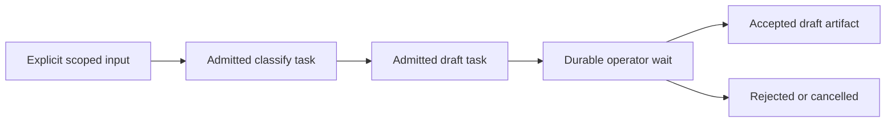

# C10.1 workflow substrate proposal

Status: architecture proposal with historical source receipt (29 September) and refreshed assessment (3 October 2026). No engine selection, product implementation, execution proof or C10 task completion is recorded here. The refresh below supersedes historical position and source-gap claims where explicitly identified.

Recommendation: evaluate a small durable workflow controller in UAR that schedules existing admitted team task attempts through the existing UAR execution owner. Start with pinned sequential draft steps and a persisted operator wait. Compare this bounded design with the existing LibreFang workflow engine before accepting a substrate decision. Do not introduce a second agent loop or reuse a process-local graph as if it were a durable scheduler.

## Authority and evidence boundary

### 3 October source refresh and exact decision still open

Canonical status read from this initiative directory reports revision **491**, lifecycle `running`, active **C10.1**. `openspec list` reports C09 complete and C10 0/3 tasks. These are orchestration observations, not fresh runtime verification. Parent execution authority remains approved; the historical planning-only wording below does not revoke it. This assessment edits only the two C10 decision documents and opens no product verification gate.

Fresh clean source scopes: UAR `/Users/gqadonis/Projects/prometheus/worktrees/agent-fabric-c09-uar` at `afeb528b794961483862436edac6b7063065d66e`; BossFang `/Users/gqadonis/Projects/prometheus/worktrees/agent-fabric-c06/librefang` at `1ba98b8bd4972b14f326d16b33a54a322c4cea99`. The inspected UAR team-execution/domain paths and BossFang workflow/store paths had no local modifications. UAR `versions.toml` was read; no pins change. The hashes later in this document remain historical and are not hashes of this refresh.

| Candidate | Current source evidence | Consequence for the smallest delivery |
| --- | --- | --- |
| UAR existing durable team substrate | `compiler/collaboration/team_execution/admission.rs:13` records digest-bound idempotent admission; `settlement.rs:13` uses catalog CAS for exclusive dispatch. `domain/team_wait.rs:185` now defines durable `TeamWait`; `waits.rs:13` accepts coordinator-owned `all-terminal` waits on 1–16 previously delegated tasks. `continuations.rs:11` evaluates waits against confirmed terminal outcomes and current authority; `runtime/team_execution/recovery.rs:13` confirms persisted yielded root/child/effect evidence. `settlement.rs:244` evaluates waits in its catalog transition. | The older comparison understated UAR: durable bounded team joins and continuation records already exist. Reuse their catalog, fencing, admission, settlement and ordinary controller. They do **not** implement definition-pinned workflows or a human decision gate. Do not invent a second wait scheduler or claim these coordinator waits are arbitrary workflow joins. |
| BossFang workflow engine | `workflow.rs:4491` executes by callback but resolves the current definition by workflow ID; `resume_run` does the same at `3672`. `WorkflowRunRow` stores the ID, not the executable snapshot/digest. `recover_stale_running_runs` at `2813` demotes stale Pending/Running rows to Failed; boot invokes it (`kernel/boot.rs:3174`). `upsert_run_to_store` at `6531` returns no result and logs/counts persistence failure after memory state changes. | Correct the old inference that no stale-run reconciliation exists. It exists, but failing stale rows is not pinned continuation recovery. Adoption still needs pinned definitions, durable transition acknowledgment and UAR attempt mapping/fencing. Its larger step vocabulary does not remove those changes. The callback boundary is reusable; embedding this entire engine is not established as the smaller change. |
| `cand-007` external reference | `.kbd-orchestrator/phases/agent-fabric-convergence/library-candidates.json` identifies it as **kind: pattern**, **registry: none**, name “External durable workflow engine”. R5 §10 describes an evaluation category, with no named engine, version or source checkout. | There is no concrete external implementation to benchmark or to assign recovery/mobile/cost guarantees. Naming Temporal, Restate or another product as though cand-007 already selected it would invent a decision. This row is **not instantiated / unmeasured**, rather than rejected or passed. A concrete reference and bounded comparison scope must be nominated before the required measured selection can close. |

**Recommended architecture for review:** add a definition-pinned workflow aggregate and exact human-decision receipt to the existing UAR collaboration catalog. Its revision/CAS transitions prepare deterministic task/admission/dispatch commands; the existing `TeamExecutionRuntime` drains and executes the original attempts. Persist the workflow-to-task mapping and command identity before admission; after a crash, replay that admission command to recover its original receipt, then link the same attempt. Record dispatch through the existing durable dispatch-intent path (`team_execution/dispatch.rs`), never a second queue. Integrate progression at settlement/recovery plus startup reconciliation so a lost notification cannot strand a committed next-step obligation. The notification is a wakeup hint, never the durable obligation.

New records are limited to the pinned run/step mapping, interpretation/plan digest, progression disposition and exact artifact-bound operator wait/decision receipt. Existing task attempts, artifacts, budgets, execution ownership, peer waits and continuation receipts retain their owners. The two-step `classify → draft → decision` operation needs no coordinator model turn and must not create a fake `team_wait` continuation to obtain an operator pause. Its decision finalizes the internal draft without another attempt. This is a design proposal, not an implemented transaction guarantee.

**Exact unresolved approval:** accept this UAR-owned progression adapter and the bounded first-delivery contract (required versioned interpretation, closed artifact selectors, internal-draft-only decision, and known-output/held-accounting policy) **after** the mandated comparison supports selection. The present source comparison supports a candidate recommendation only. The current C10 design requires a measured comparison before engine selection, while both documents place runtime measurements at the completed-delivery boundary; this is an unresolved sequencing decision. The operator must either authorize a bounded comparison implementation/measurement stage with a named external reference before production selection, or explicitly amend C10's selection criterion to permit source-backed initial selection and defer performance/conformance measurements to completed delivery. This assessment chooses neither, grants no waiver and does not ask to reauthorize the already-approved parent phase. A benchmark exception to the delivery gate must be explicit; it cannot be inferred by a worker.

No runtime, benchmark, service operation, product code or test was executed for this refresh. C10.1 stays incomplete until the selected contract and required pinned-restart evidence are accepted. Mobile/offline behavior, progression cost, durable timers, workflow DAG joins, retry/compensation and external effects remain unmeasured or unsupported for this slice.

### Historical 29 September receipt

This document supports [C10 proposal](openspec/changes/afc-c10-feedback-workflow-and-governed-connector-effects/proposal.md), [design](openspec/changes/afc-c10-feedback-workflow-and-governed-connector-effects/design.md), [tasks](openspec/changes/afc-c10-feedback-workflow-and-governed-connector-effects/tasks.md), specifically task 1.1 / C10.1, and REC-046 / REC-059. Those documents were read in full, together with the capability spec. The initiative root authorizes planning edits only. Product work needs repository-scoped changes, reconciled specifications, exact file claims and dependency checkpoints.

The canonical position projection remains C09.3 at revision 344. This preparation does not advance that position. OpenSpec reports C10 planning artifacts complete; its three implementation tasks remain unchecked. That distinction is preserved.

Inspected snapshots:

| Repository | Checkout | Recorded HEAD |
| --- | --- | --- |
| UAR | `/Users/gqadonis/Projects/prometheus/worktrees/agent-fabric-c09-uar` | `552baaa7885f32620667d8067c7d1f23614ebb78` |
| BossFang / LibreFang | `/Users/gqadonis/Projects/prometheus/worktrees/agent-fabric-c06/librefang` | `432cd237480d82d16bb62e218d3ba00656099976` |

The inspected product paths had no local modifications when these receipts were captured. UAR `versions.toml` was read; this proposal changes no dependencies or pins. Source observations below describe those revisions, not installed runtime conformance. No build, test, benchmark or service operation was run for this document.

## Existing substrate comparison

Paths in the UAR column are relative to the recorded UAR checkout; paths in the LibreFang column are relative to the recorded BossFang checkout.

| Requirement | Existing UAR | Existing LibreFang | Decision implication |
| --- | --- | --- | --- |
| Workflow definitions | `docs/agents/collaboration/v0.1.0-draft.2/schemas/workflow-definition.schema.json` defines immutable identity, steps, dependency IDs, effect/approval/retry/completion declarations. `src/uar/compiler/collaboration/validation/graph.rs::validate_package_graph` checks package closure and workflow DAG shape. `src/uar/api/capabilities.rs` reports workflow activation false. | `crates/librefang-kernel/src/workflow.rs::Workflow`, `WorkflowStep`, `StepAgent` define runnable workflows; agents resolve by name, ID or type through the current registry. | Accepted authoring vocabulary is not execution support. Pin executable definitions and resolved role assignments explicitly. |
| Ordinary execution ownership | `src/uar/runtime/team_execution/execution.rs` dispatches an admitted attempt through `ActorThreadSession::execute_request`, then settles its captured outcome. `src/uar/runtime/manager.rs` remains the ordinary execution owner. | `WorkflowEngine::execute_run(run_id, agent_resolver, send_message)` uses a callback; the current kernel callback calls `send_message_full` in `crates/librefang-kernel/src/kernel/triggers_and_workflow.rs:1316`. | The callback is a reusable separation pattern. Any adopted scheduler must dispatch exact admitted UAR attempts rather than introduce a competing model loop. |
| Sequential execution and joins | `src/uar/runtime/graph/engine.rs::AgentGraph::execute_with_events` follows local edges from its entry node. `GraphState` has data, messages and iteration; `NodeResult` has Continue/Finished/Error. `src/uar/runtime/thread/control.rs::wait_agents` waits on live scoped child handles, at most 60 seconds, returning the first terminal update. | `StepMode` supports Sequential, FanOut/Collect, conditions and loops; `execute_run_dag` executes dependency layers. | Existing joins are live execution mechanisms. Neither inspected contract supplies a durable pending-child join obligation and restart wakeup. |
| Durable waits | Graph execution has no suspended-workflow cursor or durable signal/timer record. | `StepMode::Wait` at `workflow.rs:5258` uses cancellation-aware `tokio::time::sleep`. Operator/Approval pauses persist paused index, variables, input and a hashed resume token; `resume_run` is at line 3594. DAG pause/resume is explicitly unsupported. | Reuse the operator pause shape as a requirement reference. A persisted wait must not depend on a sleeping process or open UI request. |
| Restart and definition pinning | `src/uar/runtime/checkpoint.rs::Checkpoint` protects state/history and authorization digest, not a workflow definition digest. `CheckpointNode` warns and continues if checkpoint persistence fails. | `WorkflowRun` and `crates/librefang-memory/src/workflow_store.rs::WorkflowRunRow` store `workflow_id`, without definition snapshot/digest. `execute_run` and `resume_run` fetch the current registered definition. `load_runs()` restores records without reconciling stranded Running executions. | Existing checkpoints/run persistence are insufficient for the required pinned restart. A durable transition must commit successfully before suspension or dispatch. |
| Exclusive execution claim | `src/uar/compiler/collaboration/team_execution/settlement.rs::claim_team_dispatch(&TeamExecutionAttempt)` CAS-transitions queued to running and rejects a repeated claim. Attempt fences bind owner/workspace/team/task/member and execution authority. | `execute_run` sets Running without a persisted eligibility CAS; `WorkflowStore::upsert_run` is an upsert, not an executor lease. | Reuse C09 admission/claim as the agent execution boundary. Add durable workflow progression ownership; do not dispatch from two schedulers. |
| Retry and compensation | Workflow definitions declare bounded attempts and `reconcile-before-retry`; workflow scheduling is unimplemented. C09 preserves ambiguous execution and reservations rather than replaying it. Existing tool admission records distinguish intent, terminal evidence and unknown outcome. | `ErrorMode::Retry` adds local retry/backoff. No durable retry due-time/attempt contract or compensation execution contract was found in the inspected engine. | Generic error retry cannot authorize replay after an unknown effect. Automatic retry and compensation remain unsupported in the first slice. |
| Storage and operational profile | Existing catalog persistence and protected checkpoints avoid requiring a new scheduler service. Actual profile conformance remains to be proved. | `WorkflowStore` uses the existing SQLite pool, with JSON fallback in the engine; `WorkflowRunner` exposes run/list/describe/status and owned/asynchronous invocation. | Reuse storage and inspection patterns where compatible. Source presence does not establish embedded/mobile/offline compatibility or throughput. |

The external durable engine `cand-007` remains a reference, as required by C10 design. Its current dependencies, embedding behavior and performance were not investigated here. It cannot be selected or disqualified on this source receipt.

## Proposed smallest useful operation

In Boss, an operator selects an installed workflow definition and supplies a bounded feedback input. The workflow produces a classification and a reviewable draft, then shows **Awaiting your decision**. The operator can accept the draft, reject it or cancel the run. Acceptance finalizes an internal artifact; it does not create an issue, send a message, publish, promise a roadmap item or admit implementation.

Proposed execution sequence:



The first supported profile has a finite sequential chain, one active task attempt at a time, explicitly selected predecessor artifacts, declared output contracts and no external write effects. The workflow controller advances committed records and calls existing task admission/dispatch. Each task still executes through the ordinary UAR kernel. Product conversation history remains in Boss; execution context and durable workflow state remain with UAR.

Operator wait needs a formal contract addition. The current draft.2 workflow schema has no operator-wait step kind; `approval: operator-exact-effect` is not a general workflow pause. The repository-scoped change must define and version the supported profile and its run-control semantics before implementing it. It must not accept new step fields silently or reinterpret effect approval as implementation authorization.

## Proposed durable identity and state contract

These are design requirements, not existing API names or implemented DTOs.

- A workflow run has a stable owner/workspace-scoped ID, immutable workflow definition reference and digest, schema/compiler interpretation version, pinned team/role definition references, and recorded deployment binding revision. Restart never resolves a newer definition merely because it has the same name or ID. Current authority must still be revalidated; pinning does not preserve revoked rights.
- A workflow step maps durably to one canonical team/task ID. The run records that mapping before dispatch. Existing `TeamExecutionAttempt.id` and `run_id` remain the execution identities; there is no parallel workflow-owned agent attempt or model run.
- Every admission/control command has a durable scoped command ID and request digest. Repeating the same command returns its prior result; a conflicting payload is rejected. Store the original task/attempt linkage so recovery cannot manufacture a replacement attempt.
- Commit step readiness, admission linkage and progression under revision/CAS control. One controller owns each transition. Reuse `admit_team_task`, `claim_team_dispatch`, `revalidate_team_attempt` and `settle_team_attempt` where their existing semantics fit; workflow progression and wait records are new work.
- Persist operator-wait identity, run revision, presented artifact IDs/digests, allowed decisions and decision receipt. Waiting releases live execution resources. An authenticated decision applies once to the exact wait and current authority, then finalizes the internal draft or rejection/cancellation state.
- Show execution uncertainty separately from usage uncertainty. C09 `execution_outcome` can identify a known result while usage remains unsettled. Held reservations must remain visible and charged; a missing post-restart ledger is not zero usage. Advancing a known-output step requires committed output, confirmed required effects and explicit policy for remaining reservation/authority constraints.

## Restart and recovery rules

On restart, load the pinned workflow and committed step/task/attempt mapping. A persisted operator wait reappears with the same artifact and decision identity. A committed terminal task supplies its existing output; it is not executed again to reconstruct context.

Before recovering an attempt, establish that no local producer is live. C09 recovery marks abandoned running attempts uncertain rather than replaying them. Queued intents are eligible only through their original CAS claim. A workflow whose last execution or required effect is ambiguous remains visibly blocked for reconciliation. Operator recovery is revision-bound and command-idempotent.

Cancellation commits the run's requested disposition and uses existing runtime cancellation for an associated live attempt. The final state follows captured terminal cleanup; requesting cancellation is not proof that effects stopped. Recovery and cancellation must not advance a dependent task while the prior execution still owns authority.

Do not use `memory/workflow_mirror.rs` or KBD progress projections as workflow execution authority. They represent mirrored planning metadata, not a workflow task/attempt ledger. Do not use `GraphState.iteration` as a restart cursor or rely on best-effort `CheckpointNode` persistence for a committed suspension.

## Required comparison before acceptance

The recommended UAR controller is a candidate, not a completed engine decision. Compare it with a LibreFang adapter and the reference candidate against the same bounded workload. Record exact versions, storage/backend profile, execution owner and observed outcomes.

| Comparison row | Evidence required at the completed delivery boundary |
| --- | --- |
| Definition pinning | Change/update the registered definition while a run waits; after restart, the original run retains its exact steps and artifacts. |
| Recovery and ownership | Interrupt execution around admission/claim/settlement; recover the original identities without duplicate dispatch. A competing controller cannot claim the same intent. |
| Durable waits/joins | Demonstrate the supported operator wait across restart. Record timer/signal waits and joins as unsupported until their own durable obligation/wakeup scenarios pass. |
| Retry/effects | Unknown execution/effect outcome blocks replay. Later connector qualification must show one issue or visible uncertainty after a lost response, with intent/decision/outcome references. |
| Embedding/offline/mobile | Measure the supported local profile with the relevant services unavailable; record platform/toolchain/storage constraints. Desktop source inspection does not certify mobile. |
| Throughput/cost | Measure progression overhead, persisted transitions, recovery latency, memory/storage use and operational service cost separately from model latency/cost. No numbers are available from this document. |

C10.1 remains pending until its selected owner/adapter contract is accepted and the relevant pinning/recovery evidence is recorded. A successful draft slice does not complete C10.2/C10.3 or certify the full feedback connector capability.

## Dependencies, ownership and exclusions

Consume the C05 full-run ownership contract, C07/C08 scoped delivery identities, and the accepted C09 durable task/attempt/artifact and usage contracts. C09 source and packaging receipts are separate dependencies; a commit alone is not the installed operational gate. Honor D-UAR-P1, D-MINI, D-GATE and D-MEMORY checkpoints from [dependencies.md](dependencies.md).

After the decision, proposed product ownership is: UAR owns workflow records, admission, progression, wait/recovery and ordinary execution integration; Boss owns run inspection and explicit operator controls; BossFang supplies feedback ingress using the agreed identity contract. Exact files and interface names require their repository-scoped plans. Gate or memory adapters change only for a demonstrated owner-approved integration gap.

Unsupported first-slice semantics: parallel/DAG joins, timers or external signals, loops, automatic retries, compensation/sagas, notification delivery, cross-runtime scheduling and connector writes. Required unsupported semantics must be refused, never ignored. C10.2 owns GitHub/Notion/Slack/Jira target/credential/egress boundaries and unknown-effect reconciliation; C10.3 owns intake/deduplication/standing-policy and product/design/reviewer flow. No financial action is included.

## Source hashes

SHA-256 of the inspected files, supplementary to the recorded Git revisions:

```text
UAR src/uar/runtime/graph/engine.rs
db04863ef6ffc892f186742135cbd44cb03f5e32b1a6ca8ba82cd4486fbbf53a
UAR src/uar/runtime/checkpoint.rs
35f6bfbca4ae3e1404d3c72e60e028d53b6cb2269613df5bd65f7b5f846e1eaf
UAR src/uar/compiler/collaboration/team_execution/settlement.rs
12c90c18d0912fb4946e58c881f2f3a9e59f42217113c82617d19ee0cf3962f7
UAR src/uar/domain/team_execution.rs
ba46d1f753e35e397ec0ae3b7d576a332913409543a2317279e2773c2ff0b16f
LibreFang crates/librefang-kernel/src/workflow.rs
41da497f645a0483f8343663f854a3264666e29c0e51ac34f3cc12edf6aabf60
LibreFang crates/librefang-memory/src/workflow_store.rs
7c2e1aa560187b0f21606b4e3cac404dfd349ff99aacb0f0e36332e63b1f9168
LibreFang crates/librefang-kernel-handle/src/workflow_runner.rs
f766898d25becfabf7c3e47f8b386b57d9e4560f38a42d6d4ff9b68058ed80aa
LibreFang crates/librefang-kernel/src/kernel/triggers_and_workflow.rs
99ae72f2999860d950d60c3e65dda827c19a0d9dbdc9ecc79467d2b783aa23ab
```
